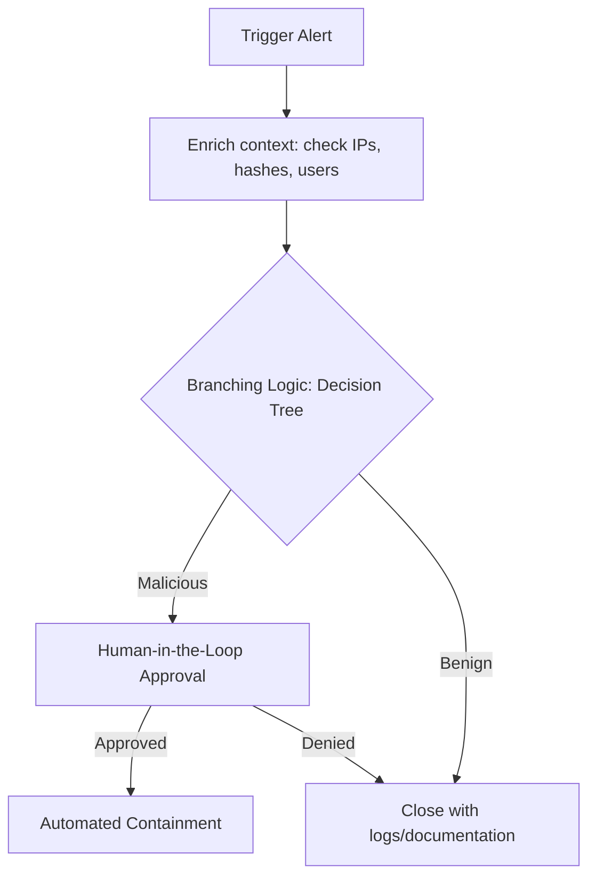

A security playbook is a documented, step-by-step workflow that defines how to detect, triage, investigate, and respond to specific types of security events. A well-designed playbook ensures consistent incident handling, speeds up containment, and prevents analysts from reinventing the wheel during an active incident.

---
## 🎯 Playbook Design Fundamentals

Every playbook should be built around a core set of design principles to ensure reliability and minimize business disruption.

---

## 🏗️ Core Design Principles

### 1. Define a Trigger

[!IMPORTANT] **Playbook Entry Point:** What should come first in any playbook is **a clear trigger defining what event starts the workflow**. Vague triggers like _"Malware detected"_ create confusion. Instead, use specific conditions like _"CrowdStrike EDR alert type: Malicious Process Detected, severity: High"_.

### 2. Enrich First, Act Second

Before executing containment actions, enrich the alert with contextual data (e.g., query IP reputation, fetch active directory user roles, and check host asset criticality).

### 3. Implement Branching Decision Logic

[!TIP] **Decision Trees vs. Linear Steps:** The primary benefit of decision tree logic over linear steps is that **it handles the branching outcomes common in real incident scenarios**. Real-world security investigations are rarely linear. They require conditional branching based on the results of enrichment (e.g., hash reputation, host severity, VIP status).

### 4. Human-in-the-Loop for Critical Containment

[!WARNING] **Mitigating Business Impact:** Critical actions like network isolation should require human approval because **auto-isolating the wrong system could disrupt business operations**. Isolating an analyst's laptop is low-risk; isolating a primary domain controller or active database server can cost the company millions in downtime. Playbooks must require manual authorization before executing high-impact containment commands.

---

## 📋 Common Playbook Mistakes to Avoid

- **Over-Automation:** Isolating hosts immediately without checking if they are critical servers.

- **No Error/Failure Handling:** Failing to define what happens if threat intelligence APIs are offline.

- **Hardcoded Values:** Storing specific IP addresses, server names, or user emails directly in the playbook code rather than utilizing variables or dynamic lookups.

- **Lack of Version Control:** Editing playbooks directly in production without git-based tracking.