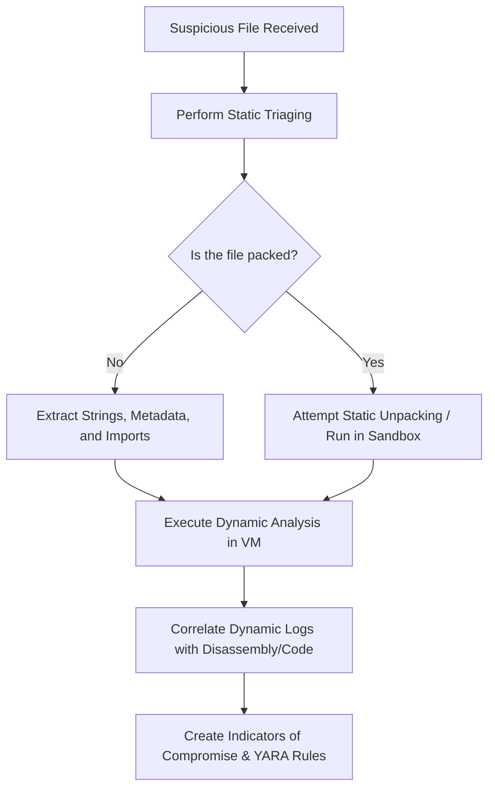

Malware analysis typically falls into two primary categories: **Static Analysis** and **Dynamic Analysis**. In this lesson, we will compare these two methods, explore their tools, strengths, limitations, and learn how to combine them for a comprehensive analysis.

---
## 🧭 Static Analysis: Examining Without Executing

Static analysis involves examining a malware sample as a static file on disk. You analyze its structure, strings, imports, headers, and code without ever executing it. Because the file is never run, static analysis represents the safest form of analysis with zero risk of accidental infection.
### What Static Analysis Reveals

- **File Metadata:** Hash values (MD5, SHA-256, ssdeep), file type, compile timestamp, file size, and entropy.

- **Embedded Strings:** Readable text inside the binary that may reveal C2 URLs, IP addresses, file paths, registry keys, error messages, or command line arguments.

- **Import Table (IAT):** Which Windows APIs the malware requests from system DLLs.
    
    - Imports like `CreateRemoteThread`, `VirtualAllocEx`, and `WriteProcessMemory` strongly suggest **process injection** capabilities.
    - Imports like `InternetOpenUrl` and `HttpSendRequest` indicate **network communication**.
    
- **PE Headers:** The structure of a Portable Executable (PE) file, revealing compile metadata, entry point, section names (`.text`, `.data`, `.rsrc`), and section sizes.
- **Packing & Obfuscation Detection:** Identifying whether a binary has been packed to hide its contents.

[!NOTE] **Real-World Scenario:** If you receive a suspicious executable and run a strings utility on it, and it reveals: `"C:\Windows\System32\cmd.exe"`, `"http://evil.com:4444/beacon"`, `"schtasks /create"`, and `"HKCU\Software\Microsoft\Windows\CurrentVersion\Run"`, you don't even need to execute it to form a hypothesis.

Without executing it, you can conclude: **The malware likely establishes persistence via a scheduled task and registry run key, and communicates with a C2 server at evil.com:4444**.

### Common Static Analysis Tools

- **PE-bear / CFF Explorer:** Examining PE headers, sections, and import tables.
- **strings / FLOSS:** Extracting ASCII and Unicode strings (FLOSS also decodes simple obfuscated strings).
- **Detect It Easy (DIE):** Identifying compilers, linkers, crypto signatures, and packers.
- **YARA:** Pattern-matching tool to identify malware family signatures.
- **Ghidra / IDA Pro:** Disassemblers and decompilers for reverse engineering.

---
## ⚡ Dynamic Analysis: Running and Observing

Dynamic analysis involves running the malware in a controlled, isolated sandbox environment and monitoring its behavioral actions in real-time. This reveals what the malware _actually does_ when it executes.
### What Dynamic Analysis Reveals

- **Actual Behavior:** File modifications (creating, writing, deleting files), registry changes, and spawned processes.

- **Network Activity:** Outbound connections to C2 servers, protocols used (HTTP, DNS, TCP), DNS queries, and DGA (Domain Generation Algorithm) activity.

- **Persistence Mechanisms:** Identifying exactly how the malware ensures it runs after a system reboot (e.g., creating a service or adding a run key).

- **Unpacking in Memory:** Since packed malware must eventually unpack its payload in memory to run it, dynamic analysis captures the unpacked malicious payload.

[!IMPORTANT] **Handling Obfuscation:** When a malware sample is heavily packed (e.g., with UPX), static analysis tools will be severely limited, showing only a standard DOS header stub and packer-specific headers.

To bypass this, you must: **Unpack the binary (UPX can typically be unpacked with "upx -d") or run it in a sandbox to observe its actual behavior after unpacking**.
### Common Dynamic Analysis Tools

- **Process Monitor (ProcMon):** Real-time monitoring of file system, registry, process, thread, and DLL activity.

- **Wireshark / tcpdump:** Capturing and inspecting live network packets.

- **Process Hacker / Process Explorer:** Inspecting active processes, loaded DLLs, memory strings, and handles.
- **Regshot:** Taking system registry snapshots before and after execution to detect changes.

- **CAPE / Cuckoo Sandbox:** Automated sandbox environments that execute malware and generate comprehensive behavior logs.
---
## ⚖️ Strategic Comparison & Evasion

|Feature / Aspect|Static Analysis|Dynamic Analysis|
|---|---|---|
|**Execution Required?**|❌ No|Yes|
|**Risk Level**|🟢 Extremely Safe (No execution)|🟡 Medium-High (Requires secure isolation)|
|**Complexity**|🟢 Low to Medium|🟡 Medium to High|
|**Obfuscation Resistance**|❌ Poor (Packed code is hidden)|Excellent (Reveals behavior at runtime)|
|**Analysis Speed**|⚡ Fast initial triaging|⏱️ Takes time to execute and monitor|

### Limitations & Evasion Techniques

Malware authors write code specifically designed to defeat analysts. Both methods have significant weak points:

- **Static Analysis Weaknesses:** Completely blind to packed code, dynamically resolved APIs (loaded via `GetProcAddress` and `LoadLibrary` at runtime), and encrypted strings.

- **Dynamic Analysis Weaknesses:** Malware can employ **Sandbox Detection** (checking for VMware, VirtualBox, or debugger tools) or **Time-Based Evasion**.

[!WARNING] If a malware sample sits in a sandbox doing nothing for 72 hours, and then suddenly encrypts files and beacons to a C2 server, it is actively using **Time-Based Evasion (delayed execution), where the malware waits for a specific duration to outlast sandbox analysis windows**. Sandbox analysis runs are usually limited to a few minutes, so delayed execution is a highly effective way to bypass automated dynamic defenses.

---
# 🎯 Best Practice Workflow

For the most robust and accurate analysis, dynamic and static methods should be performed together in a continuous feedback loop:

